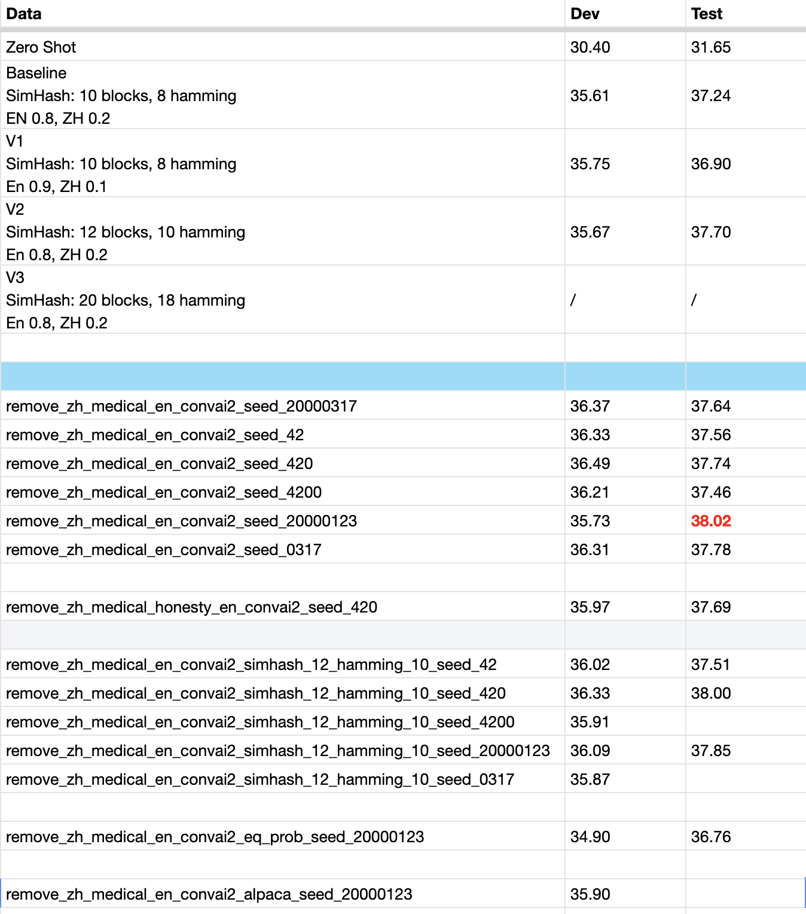

# FT-Data-Ranker：大语言模型微调数据竞赛--7B模型赛道
- 比赛链接：https://tianchi.aliyun.com/competition/entrance/532158
- 队伍：太棒了（975209）
- 最终排名：第2名

## 方案概述
1. 搜索数据组成；
2. 随机种子调优；

## 代码执行
### 环境配置
- 参考：https://tianchi.aliyun.com/competition/entrance/532158/customize405
    - 使用Docker方法配置；
    - 将下载的数据集挂载到`/official-datasets-and-models/`；
- 完成基本数据集处理：
    - 将配置中的输出路径改为`/workspace/processed_data/`；
```bash
cd /workspace/data-juicer/
python tools/process_data.py --config configs/data_juicer_recipes/alpaca_cot/alpaca-cot-en-refine.yaml
python tools/process_data.py --config configs/data_juicer_recipes/alpaca_cot/alpaca-cot-zh-refine.yaml
```
- 脚本定制修改：
```bash
cd /workspace/
git clone git@github.com:yuanyehome/FT-Data-Ranker-7B.git
cp FT-Data-Ranker-7B/deepspeed_train_7b_lora_custom.sh /workspace/lm-trianing/train_scripts/deepspeed_train_7b_lora.sh
```

### 最终采用的数据组成生成
```bash
python run.py --remove_zh_keys Alpaca-CoT/Chinese-medical/chinesemedical.json --remove_en_keys Alpaca-CoT/ConvAI2/persona_train_self_original.json --exp_name remove_zh_medical_en_convai2 --seeds 42 420 4200 20000123 0317 --gpus 0 1 2 3 4 5 6 7
```

### Ablation Results

